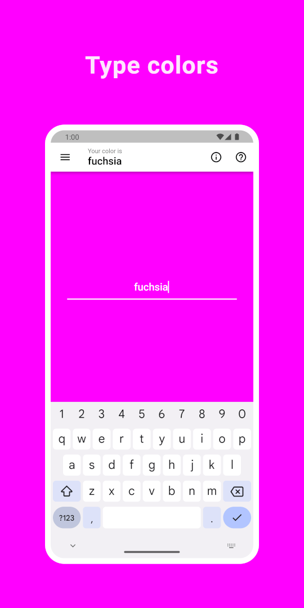
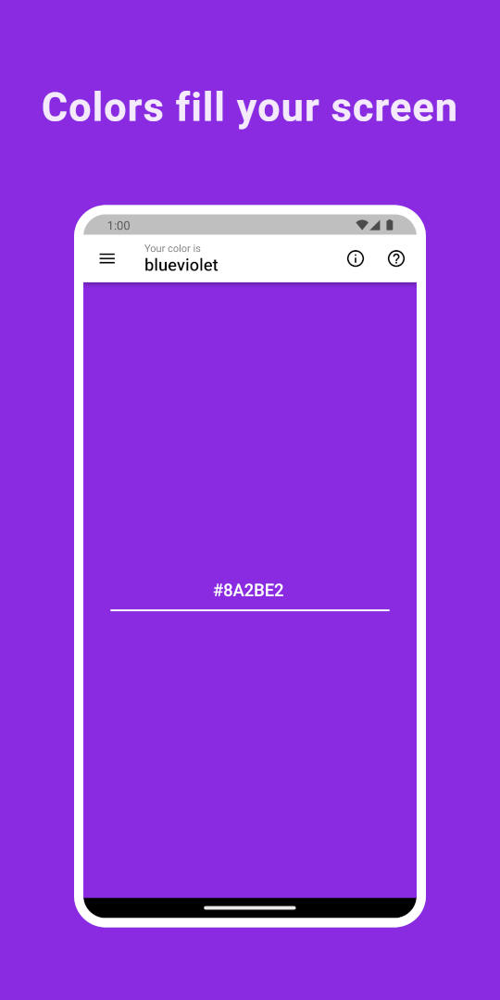
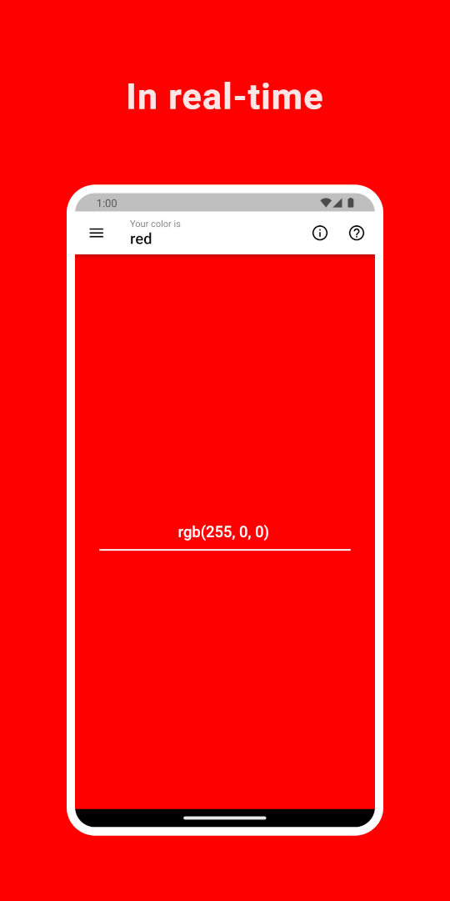
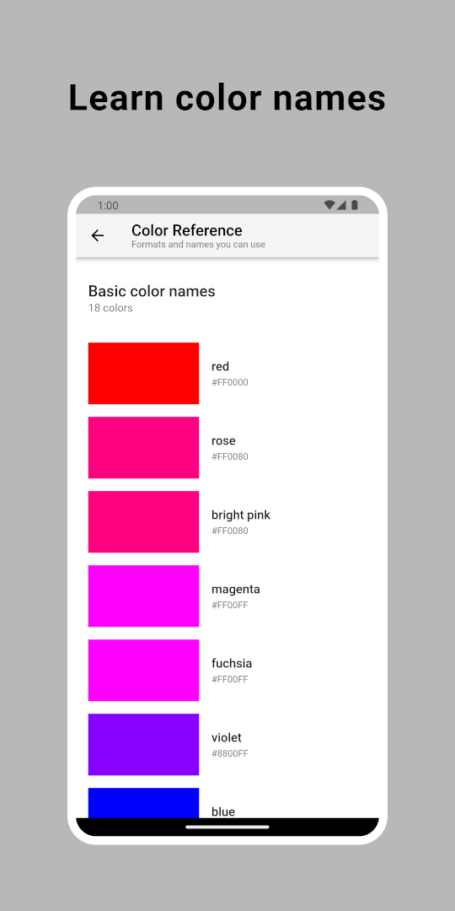
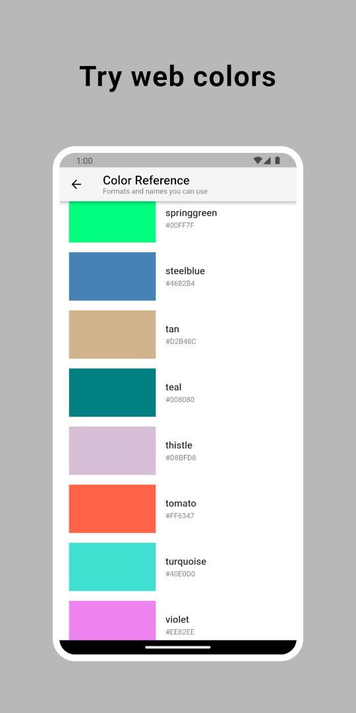
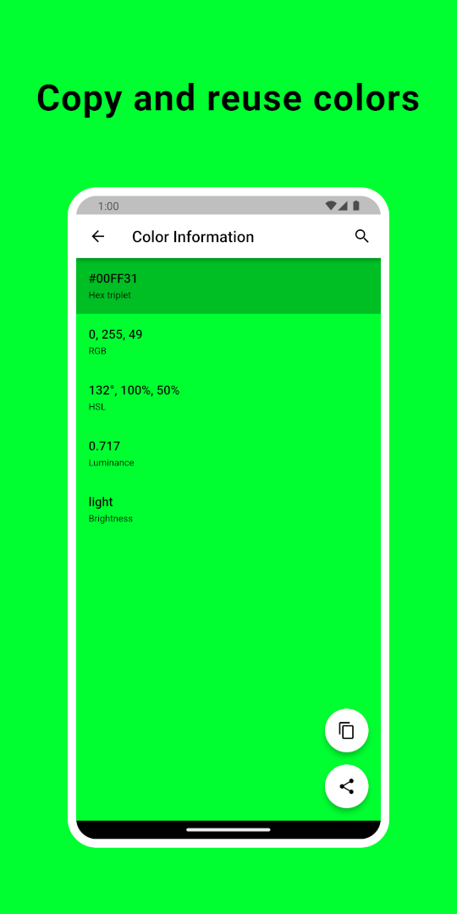
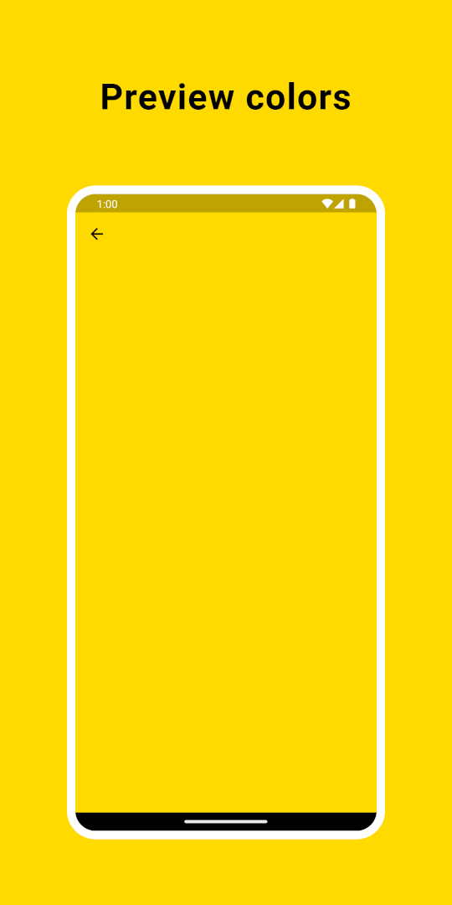
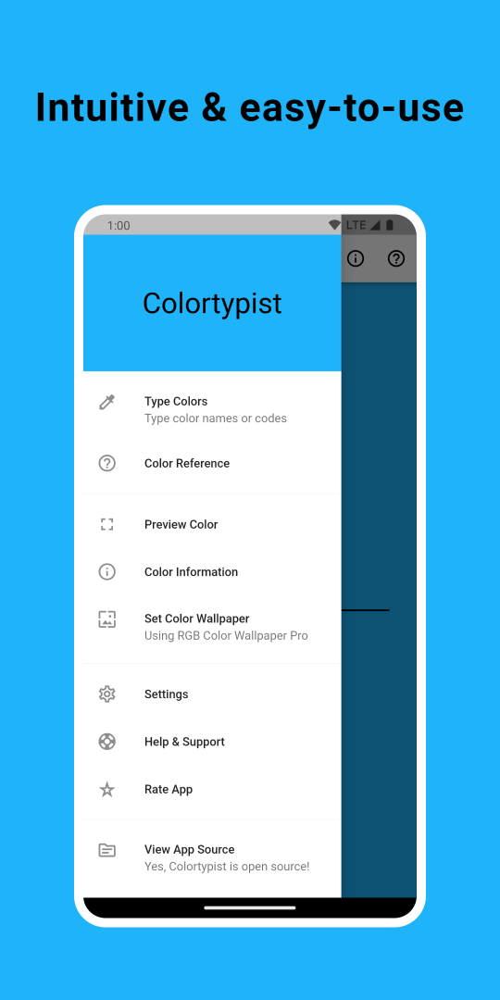

# Colortypist

[](https://flutter.dev/)

[](https://github.com/tecdrop/colortypist/actions/workflows/build-flutter-web.yml)
[](https://github.com/tecdrop/colortypist)
[](https://github.com/tecdrop/colortypist/commits/main)
[](https://github.com/tecdrop/colortypist/blob/main/LICENSE)

Introducing the Colortypist! Finally, an app that lets you see the colors you're typing in real-time!

With Colortypist, you can type in a color by its name or code and see it fill your entire screen in real-time while you type. Colortypist lets you play around with colors, learn and practice color names and formats, and get inspiration for anything that's related to colors.

Colortypist is a nice tool for anyone who is interested in colors and color theory. The app is great for artists and designers who need to find the right color for their work. It's also a great tool for teachers who want to help students learn color names, practice correct spelling, and understand color codes and formats better. It's fun and addictive, making it a great way to introduce color to children.

You can reuse, copy, and share your favorite colors with Colortypist, or you can look up more details about them online.

Colortypist is the perfect tool for anyone who wants to add a little color to their screens. Literally.

## Screenshots

<p>
  
  
  
  
  
  
  
  
</p>

## How to Run the App

| Platform  | Options |
| ------------- | ------------- |
| Android  | [Install from Google Play](https://play.google.com/store/apps/details?id=com.tecdrop.colortypist) <br> [Download APK from GitHub Releases](https://github.com/tecdrop/colortypist/releases)|
| Any  | [Run the web app in your browser](https://colortypist.tecdrop.com/)  |

## Getting Started

1. If you don't have the Flutter SDK installed, please visit the official [Flutter](https://docs.flutter.dev/get-started/install) website.

2. Fetch the latest source code from the main branch.

``` 
git clone https://github.com/tecdrop/colortypist.git
```

3. Run the app with Visual Studio Code or Android Studio, or using the command line.

``` 
flutter pub get
flutter run
```

## Built With

- [Flutter](https://flutter.dev/) - Build apps for any screen.
- [Visual Studio Code](https://code.visualstudio.com/) - Code editing. Redefined.
- [GitHub Pages](https://pages.github.com/) - Websites for you and your projects, hosted directly from your GitHub repository.

### Plugins

- [from_css_color](https://pub.dev/packages/from_css_color) - Creates Color instance from CSS color string.
- [shared_preferences](https://pub.dev/packages/shared_preferences) - Wraps platform-specific persistent storage for simple data.
- [url_launcher](https://pub.dev/packages/url_launcher) - A Flutter plugin for launching a URL.
- [share_plus](https://pub.dev/packages/share_plus) - A Flutter plugin to share content from your Flutter app.

## Contribute

If you have an issue or found a bug, please raise a GitHub issue [here](https://github.com/tecdrop/colortypist/issues). Pull requests are also welcome.

## Acknowledgments

- The basic color names and values are imported from the [12 RGB C O L O R S](https://www.1728.org/RGB.htm) article
- The extended color names and values are imported from Randall Munroe's [xkcd color name survey](https://xkcd.com/color/rgb/)

## License

Colortypist is licensed under the [MIT license](LICENSE).
